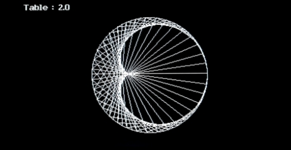

# Cardioide

Représentation visuelle de cardioïde en fonction de la table souhaitée pour fx-cg50 / 90+E
<h3 align="center">  </h3>

## Utilisation :

Build avec gint de Lephenixnoir avec le fxsdk + openlibm.
`$ fxsdk build-cg`

Sur calculatrice :
Deux modes (F1 / F2).
Avec F1 :
- touche de droite pour augmenter la table
- gauche pour baisser

Avec F2 :
- touche de droite pour augmenter le nombre de point
- gauche pour baisser

N'importe : 
- Shift : Défilement automatique
- Alpha : Fin du défilement
- Exit : quitter
- OPTN : affiche / enlève les informations (augmente la vitesse)
